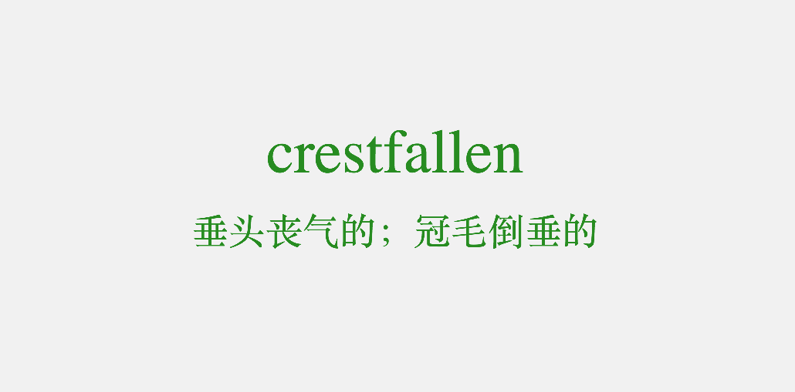

# vocabulary-test
A very simple static webpage for vocabulary self-testing, can be used to help remember new words. Click spacebar or touch it to get new word or to see its translation.

* Single file
* Minimal functionalities
* Vocabulary list can be easily editted
* Run in browsers on PC, iPad & Smartphone
* Do not need network connection

### Screenshot

